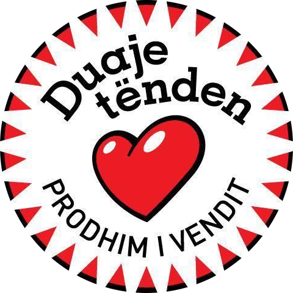

# Priml
Priml (pronounced Prim-l), short for PrimitiveLanguage, is a stack-oriented language based on Forth and BASIC, that compiles into **[ReWave](https://github.com/x-Eagle-x/ReWave)** bytecode.

#### Currently Priml has support for:
- Macro-functions
- External calls
- Functions (sub regions)
- Addressing (goto regions)
